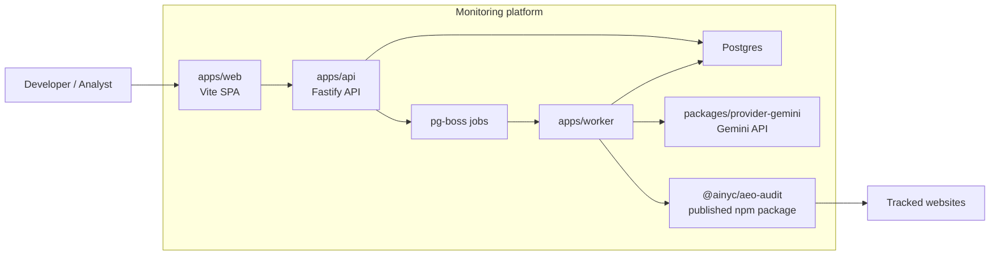

# Canonry

`canonry` is a self-hosted AEO monitoring app that uses the published [`@ainyc/aeo-audit`](https://www.npmjs.com/package/@ainyc/aeo-audit) package as its shared technical-audit engine.

This repo is the monitoring product. It is separate from the audit package repo on purpose:

- `@ainyc/aeo-audit` remains the published audit library and CLI
- `canonry` owns the API, worker, web app, provider integrations, and persistence layer

## What Lives Here

- `apps/web`: monitoring UI
- `apps/api`: Fastify API
- `apps/worker`: background jobs and provider execution
- `packages/contracts`: shared DTOs and enums
- `packages/config`: shared environment parsing
- `packages/db`: schema and DB adapter placeholder
- `packages/provider-gemini`: Gemini adapter placeholder
- `docs/`: product, architecture, testing, and self-hosting docs

## Local Development

```bash
pnpm install
pnpm run typecheck
pnpm run test
pnpm run lint
```

Run services individually:

```bash
pnpm run dev:api
pnpm run dev:worker
pnpm run dev:web
```

## Docker Quick Start

```bash
cp .env.example .env
pnpm run docker:up
```

Expected endpoints:

- Web: [http://localhost:4173](http://localhost:4173)
- API: [http://localhost:3000/health](http://localhost:3000/health)
- Worker: [http://localhost:3001/health](http://localhost:3001/health)

## Architecture



See [docs/architecture.md](./docs/architecture.md) for the full system view.

## Docs

- [Architecture](./docs/architecture.md)
- [Product plan](./docs/product-plan.md)
- [Testing guide](./docs/testing.md)
- [Self-hosting](./docs/self-hosting.md)
- [Site audit design](./docs/site-audit.md)
- [Gemini provider design](./docs/providers/gemini.md)

## Relationship to `@ainyc/aeo-audit`

This repo should consume the published package, not copy its internals. Technical audit logic should be imported from `@ainyc/aeo-audit` through explicit adapters in the worker.
