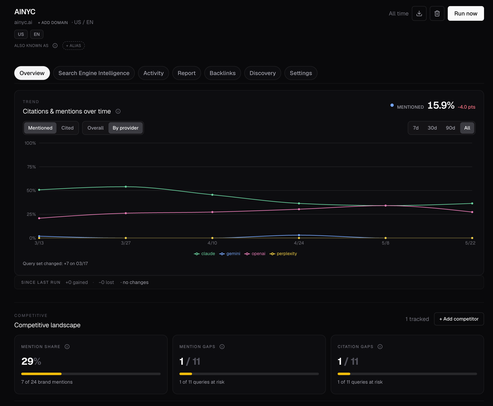

# Canonry 

[](https://www.npmjs.com/package/@ainyc/canonry) [](https://fsl.software/) [](https://nodejs.org)

## What Canonry does

Canonry tells you whether AI answer engines mention your site for the queries you care about, which competitors they cite instead, and what to fix.

In one run, you can see:

- whether your brand or domain appears in AI-generated answers
- which sources are cited instead of you
- evidence from each answer engine (Gemini, ChatGPT, Claude, Perplexity)
- recommended content or authority gaps to address



## What you get in 5 minutes

1. Add your domain and a few queries
2. Run a sweep across supported answer engines
3. Review citation evidence and visibility gaps
4. Get recommended fixes

```bash
npm install -g @ainyc/canonry
canonry init
canonry project create my-site --domain example.com
canonry query add my-site "your first query here" "second query here"
canonry run my-site --wait
canonry evidence my-site
canonry insights my-site
```

You should now see:

- whether `example.com` was cited for each query
- which competitors or sources appeared instead
- raw answer evidence per provider
- recommended next actions from the insight engine

**No API key yet?** `canonry init` walks you through provider setup interactively. If you'd rather evaluate first, the init command lets you skip provider keys entirely — you can add them later from the dashboard at `/settings`. A zero-config demo mode (`canonry demo`) is on the roadmap.

## If you get stuck

| Problem | Fix |
|---------|-----|
| No provider key configured | Add one: `GEMINI_API_KEY`, `OPENAI_API_KEY`, `ANTHROPIC_API_KEY`, or `PERPLEXITY_API_KEY` as an env var, or configure via `canonry init` or the dashboard at `/settings` |
| No results after a run | Make sure you ran `canonry run <project> --wait` — sweeps are async by default |
| Not sure what queries to test | Start with 3–5 commercial-intent queries your customers would ask an AI assistant. You can also try `canonry query generate <project> --provider gemini --save` |
| `npm install` fails with `node-gyp` errors | Install build tools for `better-sqlite3`: `xcode-select --install` (macOS), `apt-get install python3 make g++` (Debian/Ubuntu) — see the [troubleshooting guide](https://github.com/WiseLibs/better-sqlite3/blob/master/docs/troubleshooting.md) |
| Want to evaluate without keys | `canonry init` can complete without provider keys. Configure them later from the dashboard |

## Provider Setup

Configure providers during `canonry init`, via the web dashboard at `/settings`, or as environment variables:

| Provider | Key source | Env var |
|----------|-----------|---------|
| Gemini | [aistudio.google.com/apikey](https://aistudio.google.com/apikey) | `GEMINI_API_KEY` |
| OpenAI | [platform.openai.com/api-keys](https://platform.openai.com/api-keys) | `OPENAI_API_KEY` |
| Claude | [console.anthropic.com](https://console.anthropic.com/settings/keys) | `ANTHROPIC_API_KEY` |
| Perplexity | [perplexity.ai/settings/api](https://www.perplexity.ai/settings/api) | `PERPLEXITY_API_KEY` |
| Local LLMs | Any OpenAI-compatible endpoint (Ollama, LM Studio, vLLM) | `LOCAL_LLM_URL` |

Integration setup guides: [Google Search Console](docs/google-search-console-setup.md) | [Google Analytics](docs/google-analytics-setup.md) | [Bing Webmaster](docs/bing-webmaster-setup.md) | [WordPress](docs/wordpress-setup.md)

## How It Works

A typical monitoring cycle — manual or agent-driven:

```bash
canonry apply canonry.yaml --format json         # define projects from YAML specs
canonry run my-project --wait --format json       # sweep all providers
canonry evidence my-project --format json         # inspect citation evidence
canonry insights my-project --format json         # DB-backed insight analysis
canonry health my-project --format json           # visibility health snapshot
canonry content targets my-project --format json  # ranked content opportunities
```

Schedule cron-based sweeps and subscribe a webhook for agent-driven workflows:

```bash
canonry schedule my-project --cron "0 6 * * *"
canonry notify add my-project --url https://my-agent.example.com/hooks/canonry
```

## Config-as-Code

```yaml
apiVersion: canonry/v1
kind: Project
metadata:
  name: my-project
spec:
  canonicalDomain: example.com
  country: US
  language: en
  queries:
    - best dental implants near me
    - emergency dentist open now
  competitors:
    - competitor.com
  providers:
    - gemini
    - openai
    - claude
    - perplexity
```

```bash
canonry apply canonry.yaml
canonry apply project-a.yaml project-b.yaml
```

## Core Concepts

Canonry is an agent-first AEO operating platform. AEO (Answer Engine Optimization) is about ensuring your content appears accurately in AI-generated answers. As search shifts from links to synthesized responses, you need something that monitors, analyzes, and acts across engines continuously.

Canonry ships a built-in AI agent — **Aero** — that reads project state, analyzes regressions, acts through a typed tool surface, and wakes up unprompted when runs complete. Users who prefer their own agent (Claude Code, Codex, custom) consume Canonry through the same CLI/API surface.

### Talking to Aero (built-in agent)

```bash
# One-shot turn — Aero picks the right tools and analyzes on its own.
canonry agent ask my-project "Why did the last run fail? Recommend a fix."

# Pick a specific LLM:
ANTHROPIC_API_KEY=... canonry agent ask my-project "…" --provider anthropic
ZAI_API_KEY=...        canonry agent ask my-project "…" --provider zai
```

Aero uses whichever LLM has an API key configured in `~/.canonry/config.yaml` or exported as an env var. Conversations persist across invocations per project. Aero also wakes up **unprompted** after each run completes — analyzing the new data and writing the result back to the project's transcript.

### Agent roles

Canonry's CLI and API are the agent interface. Every command supports `--format json`; every dashboard view has a matching API endpoint.

- **Monitor** visibility sweeps across providers on a schedule, tracking citation changes over time
- **Analyze** regressions, emerging opportunities, and correlations with site changes
- **Coordinate** fixes across content, schema markup, indexing submissions, and `llms.txt`
- **Report** results in a machine-readable form agents can act on

### Features

- **Multi-provider.** Query Gemini, OpenAI, Claude, Perplexity, and local LLMs from a single platform.
- **Content opportunity engine.** Per-query recommendations typed by action (`create` / `expand` / `refresh` / `add-schema`) with auditable score breakdowns, drivers, and demand-source labels. Combines GSC ranking signals with competitor citation evidence.
- **Config-as-code.** Kubernetes-style YAML files. Version control your monitoring, let agents apply changes declaratively.
- **Self-hosted.** Runs locally with SQLite. No cloud account required.
- **Integrations.** Google Search Console, Google Analytics 4, Bing Webmaster Tools, WordPress.
- **Backlinks (Common Crawl).** Workspace-level release sync via DuckDB, per-project inbound-link extraction.
- **Location-aware.** Project-scoped locations for geo-targeted monitoring.
- **Scheduled monitoring.** Cron-based recurring runs with webhook notifications.

## Advanced Integrations

### MCP (Model Context Protocol)

For MCP clients like Claude Desktop, Cursor, Codex, or custom shells that prefer a typed tool catalog over shell commands, Canonry ships a stdio adapter:

```bash
canonry mcp install --client claude-desktop      # or: cursor
canonry mcp install --client claude-desktop --read-only  # 45 read API tools only
canonry mcp config  --client codex               # print snippet for unsupported clients
```

`install` merges a `canonry` entry into the client's config, backs up the original, and is idempotent. Restart the client after install. The adapter exposes 67 API tools — projects, runs, snapshots, insights, health, query and competitor management, schedules, GSC and GA reads, and the config-as-code apply path. See [`docs/mcp.md`](docs/mcp.md) for the full surface.

### Webhooks

Wire a webhook for run/insight events if you prefer your own agent (Claude Code, Codex, custom):

```bash
canonry agent attach my-project --url https://my-agent.example.com/hooks/canonry
```

Your agent receives `run.completed`, `insight.critical`, `insight.high`, and `citation.gained` notifications. Detach with `canonry agent detach my-project`.

## API

All endpoints under `/api/v1/`. Authenticate with `Authorization: Bearer cnry_...`.
The canonical surface is served at `GET /api/v1/openapi.json` (no auth required).

Every dashboard view has a matching API endpoint and CLI command. The surface is grouped by domain:

| Domain | What it covers | Highlights |
|--------|----------------|------------|
| **Projects** | Create, read, update, delete projects; locations; export | `PUT /projects/{name}`, `GET /projects`, `GET /projects/{name}/export` |
| **Apply** | Config-as-code — declarative multi-project upsert | `POST /apply` |
| **Queries / Competitors** | Per-project query and competitor management | `POST/DELETE /projects/{name}/queries`, `/competitors` |
| **Runs** | Trigger, list, cancel, and inspect visibility sweeps | `POST /projects/{name}/runs`, `GET /runs`, `POST /runs/{id}/cancel` |
| **Schedules** | Cron-based recurring sweeps | `GET/PUT /projects/{name}/schedule` |
| **History / Snapshots** | Timeline + run diffs + per-query citation state | `GET /projects/{name}/timeline`, `/snapshots/diff`, `/history` |
| **Intelligence** | DB-backed insights + health snapshots + dismissal | `GET /projects/{name}/insights`, `/health`, `POST /insights/{id}/dismiss` |
| **Content** | Action-typed content opportunities, gaps, and grounding-source map | `GET /projects/{name}/content/targets`, `/gaps`, `/sources` |
| **Notifications** | Webhook subscriptions per project (agent or user-defined) | `GET/POST/DELETE /projects/{name}/notifications`, `POST /.../test` |
| **Analytics** | Aggregated dashboard analytics | `GET /projects/{name}/analytics` |
| **Google (GSC + OAuth)** | Search Console integration, OAuth flow, property selection, URL inspection | `/google/*`, `/projects/{name}/google/*` |
| **Google Analytics (GA4)** | Traffic, social referrals, attribution, AI referrals | `/projects/{name}/ga/*` |
| **Bing Webmaster** | Coverage, URL inspection, keyword stats | `/projects/{name}/bing/*` |
| **WordPress** | Content publishing + site management integration | `/projects/{name}/wordpress/*` |
| **CDP (ChatGPT browser provider)** | Chrome DevTools Protocol health and session status | `/cdp/*` |
| **Settings / Auth / Telemetry** | Server config, API key management, opt-in telemetry | `/settings`, `/telemetry` |
| **OpenAPI** | Full spec | `GET /openapi.json` *(no auth)* |

For the complete list of ~118 endpoints with request/response schemas, query `GET /api/v1/openapi.json` or browse the per-domain route handlers under [`packages/api-routes/src/`](packages/api-routes/src/).

## Skills

Canonry ships a bundled `canonry-setup` skill that turns Aero (or any Claude-powered agent) into an AEO/SEO operator. **Claude Code** picks it up automatically from `.claude/skills/canonry-setup/` when you open this repo; the same content lives under [`skills/canonry-setup/`](skills/canonry-setup/) for portable use with other harnesses.

The skill covers the end-to-end answer-engine optimization loop:

- **AEO monitoring.** Running citation sweeps via `canonry run` / `canonry evidence` / `canonry status`, including per-query citation state and regressions.
- **Technical SEO audits.** Driving the companion [`@ainyc/aeo-audit`](https://www.npmjs.com/package/@ainyc/aeo-audit) CLI for 14-factor scoring — structured data (JSON-LD), content depth, AI-readable files (`llms.txt`, `llms-full.txt`), E-E-A-T signals, FAQ blocks, definition blocks, H1/alt/meta hygiene.
- **Indexing diagnosis.** Google Search Console and Bing Webmaster Tools coverage, URL inspection, and one-shot submissions via `canonry google request-indexing` / `canonry bing request-indexing`.
- **Schema & content execution.** Patterns for injecting LocalBusiness/FAQPage JSON-LD, writing `llms.txt` with service-area detail, trimming query lists to high-intent queries, and handling WordPress/Elementor specifics.
- **Diagnose → prioritize → execute → monitor → report workflow.** Opinionated defaults for new sites (0 citations), regressions on established sites, and county-level targeting — with guardrails like "never fabricate citation data" and "back up `~/.canonry/config.yaml` before editing".

See [`skills/canonry-setup/SKILL.md`](skills/canonry-setup/SKILL.md) plus the reference files under [`skills/canonry-setup/references/`](skills/canonry-setup/references/) for the full playbook.

## Deployment

See **[docs/deployment.md](docs/deployment.md)** for local, reverse proxy, sub-path, Tailscale, systemd, and Docker guides.

### Docker

```bash
docker build -t canonry .
docker run --rm -p 4100:4100 -e GEMINI_API_KEY=your-key -v canonry-data:/data canonry
```

Published images: [Docker Hub](https://hub.docker.com/repository/docker/arberx/canonry) | [GHCR](https://github.com/ainyc/canonry/pkgs/container/canonry)

### Railway

[](https://railway.com/deploy/ENziH9?referralCode=0vODBs&utm_medium=integration&utm_source=template&utm_campaign=generic)

Click deploy, add a volume at `/data`, generate a domain. No env vars required to start. Configure providers via the dashboard.

### Render

Create a Web Service with runtime Docker, attach a disk at `/data`. Health check: `/health`.

## Requirements

- Node.js >= 22.14.0
- At least one provider API key (configurable after startup)

## Development

```bash
git clone https://github.com/ainyc/canonry.git
cd canonry
pnpm install
pnpm run typecheck && pnpm run test && pnpm run lint
```

See [docs/README.md](docs/README.md) for the full architecture, roadmap, ADR index, and doc map.

## Contributing

See [CONTRIBUTING.md](./CONTRIBUTING.md).

## License

[FSL-1.1-ALv2](./LICENSE). Free to use, modify, and self-host. Each version converts to Apache 2.0 after two years.

---

Built by [AI NYC](https://ainyc.ai)
