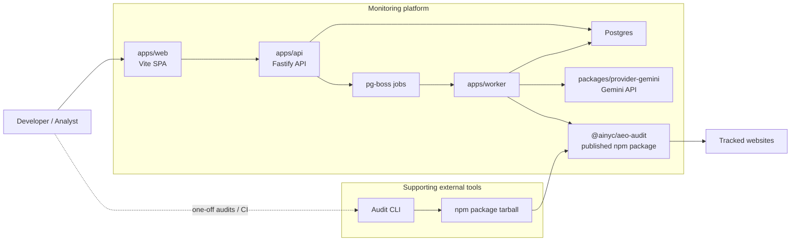
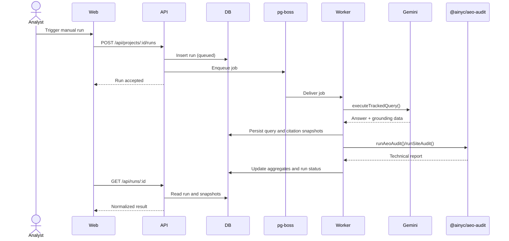

# Architecture

## Overview

This repository contains the monitoring product only. The shared technical audit engine lives in the published `@ainyc/aeo-audit` npm package and is consumed as an external dependency from the worker.

The monitoring app is the primary system. The audit CLI is outside this repo and is only supporting tooling for developers, CI, and one-off technical diagnosis.

## Component Diagram

## Why the CLI Still Exists

The monitoring app should deliver the main user experience. The CLI exists for four narrower reasons:

- one-off technical audits while debugging why a domain is or is not being cited
- CI and release checks for technical readiness outside the hosted UI
- local development and regression testing of the shared audit engine
- preserving the existing OSS audit package as a standalone tool

The primary platform path is `web -> api -> worker -> provider -> postgres`. The CLI is adjacent to that flow, not in the center of it.

## Run Flow

## Service Boundaries

- `@ainyc/aeo-audit`: shared technical audit engine, CLI, formatters, report types
- API: HTTP surface, validation, orchestration, read APIs
- Worker: jobs, provider execution, retries, future site audits
- Web: dashboard and bootstrap/setup UX
- Contracts: shared DTOs, enums, and validation shapes
- Config: typed environment parsing
- Provider Gemini: provider adapter and normalization layer
- DB: schema and database access layer

## Design Constraints

- This repo should remain independent from the audit package repo
- The monitoring app should consume only published audit-package releases
- Future hosted deployment should be possible without rewriting the core data model

## Score Families

- Technical readiness: `@ainyc/aeo-audit` and future site-audit rollups
- Answer visibility: provider-driven keyword tracking and citation outcomes

These remain separate to avoid mixing technical readiness with live-answer visibility.
