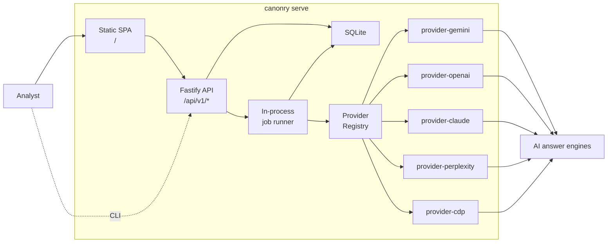
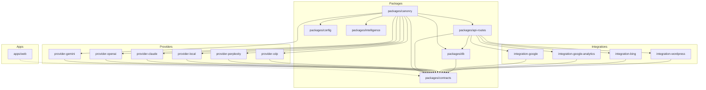
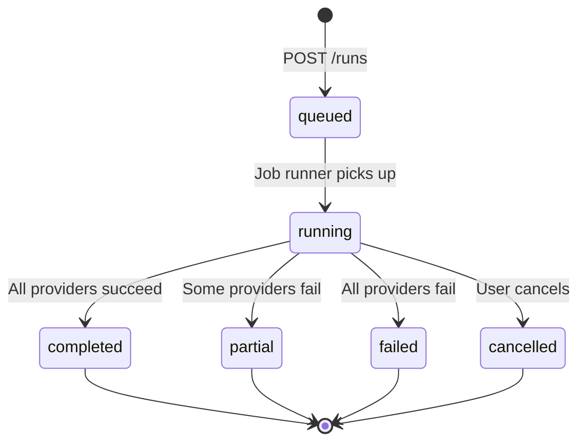

# Architecture

## Overview

Canonry is a self-hosted agent-first AEO operating platform. It tracks how AI answer engines (Gemini, OpenAI, Claude, Perplexity, and local LLMs) cite or omit a domain for tracked queries, and acts on that signal through the content engine and integrations.

Locations are modeled as project-scoped run context. A project can define named locations and an optional default location, while queries remain project-wide.

## Local Architecture

The local installation runs as a **single Node.js process** — no Docker, no Postgres, no message queue.



### Key components

- **`packages/canonry/`** — publishable npm package (`@canonry/canonry`, plus compatibility publish as `@ainyc/canonry`). Bundles CLI, Fastify server, job runner, and pre-built SPA.
- **`packages/api-routes/`** — shared Fastify route plugins. The HTTP surface consumed by the local `cnry serve` process.
- **`packages/db/`** — Drizzle ORM schema, backed by SQLite. Auto-migration on startup.
- **`packages/provider-*/`** — Provider adapters. Each implements `ProviderAdapter` from contracts.
- **`packages/contracts/`** — shared DTOs, enums, config-schema (Zod), error codes.
- **`apps/web/`** — Vite SPA source. Built and bundled into `packages/canonry/assets/`.

### Data flow

1. Analyst runs `canonry run <project>` with the project default location, an explicit `--location`, `--all-locations`, or no location context
2. API creates a run record and enqueues a job
3. Job runner resolves the run location, fans out `executeTrackedQuery` for each query across all configured providers via the provider registry, and passes the location hint to providers
4. Raw observation snapshots (`cited` / `not-cited`) are persisted per query per run, tagged with the run's location label when present
5. Transitions (`lost`, `emerging`) are computed at query time by comparing consecutive snapshots
6. Dashboard polls API for results and renders visibility data

## Module Dependency Graph



**Key rules:**
- `packages/api-routes/` must not import from `apps/*`.
- Only `packages/canonry/` is published to npm. All other packages are bundled via tsup.
- All internal packages use `@ainyc/canonry-*` naming convention.

## Run Lifecycle



**Transitions:**
- `queued` → `running`: Job runner dequeues and starts executing providers
- `running` → `completed`: All configured providers returned results successfully
- `running` → `partial`: At least one provider succeeded, at least one failed
- `running` → `failed`: Every provider failed (network errors, quota exhaustion, etc.)
- `running` → `cancelled`: User explicitly cancelled via API

## Provider System

All providers implement the `ProviderAdapter` interface from `packages/contracts`:

```
ProviderAdapter {
  name: string
  displayName: string
  mode: 'api' | 'browser'
  keyUrl?: string
  validateConfig(config) → ValidationResult
  healthcheck(config) → HealthcheckResult
  executeTrackedQuery(input) → RawQueryResult
  normalizeResult(raw) → NormalizedQueryResult
  generateText(config, prompt) → string
}
```

The `ProviderRegistry` in `packages/canonry` collects all adapters at startup. When a run executes, the job runner:

1. Reads the project's configured providers
2. For each provider, calls `executeTrackedQuery()` with the query and location context
3. Calls `normalizeResult()` to convert provider-specific responses to standard `NormalizedQueryResult`
4. Persists `query_snapshots` — one per query per provider per run

Ad-hoc research uses the same provider adapters through a separate
`research_runs` → `research_run_queries` executor. It persists returned answer
evidence and applies the same provider quota guards, but it never creates a
tracked query, shared run, snapshot, insight, notification, or schedule event.

## Deployment Model

Canonry ships as a **self-hosted single-process install** — that is the only supported deployment. You run `cnry serve` on your own machine, a VPS, or a container; the SPA, API, job runner, and SQLite database all live in that one process. See [docs/deployment.md](deployment.md) for Docker, Railway, Render, systemd, and Tailscale recipes.

## Service Boundaries

- **`@ainyc/aeo-audit`** — external npm dependency. Technical audit engine, CLI, formatters.
- **`packages/api-routes/`** — HTTP surface, validation, orchestration, read APIs.
- **`packages/canonry/`** — CLI, local server, job runner (the publishable artifact).
- **`packages/provider-*/`** — Provider adapters and normalization layers.
- **`packages/integration-*/`** — External service clients (Google, Bing, GA4, WordPress).
- **`packages/db/`** — schema, migrations, database access.
- **`packages/contracts/`** — DTOs, enums, config validation, error codes.
- **`packages/config/`** — typed environment parsing.
- **`apps/web/`** — SPA source code.

## Design Constraints

- This repo remains independent from the audit package repo
- Consume only published `@ainyc/aeo-audit` releases
- API key-based auth
- Raw observation snapshots only; transitions computed at query time

## Score Families

- **Answer visibility**: multi-provider query tracking and citation outcomes across all providers
- **Technical readiness**: `@ainyc/aeo-audit` and future site-audit rollups

These remain separate to avoid mixing technical readiness with live-answer visibility.

## Agent Layer

Canonry ships a built-in AI agent (Aero) backed by `@mariozechner/pi-agent-core`, plus a webhook path for external agents (Claude Code, Codex, custom). See `AGENTS.md` ("Agent Layer" section) for the full surface.

- **Native loop:** `packages/canonry/src/agent/` (`session.ts`, `session-registry.ts`, `tools.ts`, `agent-routes.ts`).
- **Persistence:** one rolling session per project in the `agent_sessions` table — survives `canonry serve` restarts.
- **Proactive:** `RunCoordinator` synthesizes a follow-up message after each `run.completed`; `SessionRegistry.drainNow` wakes the agent without a user prompt.
- **External agents:** `canonry agent attach <project> --url <webhook-url>` registers a webhook for `run.completed`, `insight.critical`, `insight.high`, `citation.gained`.

The agent layer is a consumer of the same CLI/API surface — nothing in it is privileged. Per AGENTS.md, "If an AI agent can't do something with `canonry <command> --format json` or an HTTP call, it's a bug."
