# Data Model

Source of truth: `packages/db/src/schema.ts`

## Entity Relationships

```mermaid
erDiagram
  projects ||--o{ queries : has
  projects ||--o{ competitors : has
  projects ||--o{ runs : has
  projects ||--o| schedules : "has (1:1)"
  projects ||--o{ notifications : has
  projects ||--o{ audit_log : has
  projects ||--o{ insights : has
  projects ||--o{ health_snapshots : has

  runs ||--o{ query_snapshots : contains
  runs ||--o{ insights : "analyzed in"
  runs ||--o{ health_snapshots : "scored in"
  queries ||--o{ query_snapshots : "tracked in"

  projects ||--o| ga_connections : "has (1:1)"
  projects ||--o{ ga_traffic_snapshots : has
  projects ||--o{ ga_traffic_summaries : has
  projects ||--o{ ga_ai_referrals : has
  projects ||--o{ ga_social_referrals : has

  projects ||--o{ gbp_locations : has
  projects ||--o{ gbp_daily_metrics : has
  projects ||--o{ gbp_keyword_impressions : has
  projects ||--o{ gbp_keyword_monthly : has
  projects ||--o{ gbp_place_actions : has
  projects ||--o{ gbp_lodging_snapshots : has
  projects ||--o{ gbp_attributes_snapshots : has
  projects ||--o{ gbp_place_details : has

  projects ||--o{ gsc_search_data : has
  projects ||--o{ gsc_daily_totals : has
  projects ||--o{ gsc_url_inspections : has
  projects ||--o{ gsc_coverage_snapshots : has

  projects ||--o{ bing_url_inspections : has
  projects ||--o{ bing_keyword_stats : has
  projects ||--o{ bing_coverage_snapshots : has

  projects ||--o{ traffic_sources : has
  traffic_sources ||--o{ crawler_events_hourly : "rolls up"
  traffic_sources ||--o{ ai_user_fetch_events_hourly : "rolls up"
  traffic_sources ||--o{ ai_referral_events_hourly : "rolls up"
  traffic_sources ||--o{ raw_event_samples : "samples"

  projects ||--o| agent_sessions : "has (1:1)"
  projects ||--o{ agent_memory : has

  projects ||--o{ discovery_sessions : has
  discovery_sessions ||--o{ discovery_probes : contains
```

## Table Groups

### Core Domain

| Table | Purpose | Key Constraints |
|-------|---------|----------------|
| **projects** | Root entity — domain, location config, provider list, optional `icp_description` (free-text ICP used by discovery seed phase) | Unique: `name` |
| **queries** | Tracked queries per project. `provenance` tags where the entry came from (e.g. `cli`, `discovery:<session_id>`) so adopted basket entries can be traced back to a discovery run. | Unique: `(projectId, query)` |
| **competitors** | Competitor domains per project. `provenance` tags origin (`cli`, `discovery:<session_id>`) for the same traceability reason. | Unique: `(projectId, domain)` |
| **runs** | Visibility sweep executions | FK: projectId → projects |
| **query_snapshots** | Per-query per-provider results | FK: runId → runs, queryId → queries |
| **schedules** | Cron schedules (1:1 with project) | Unique: projectId |
| **notifications** | Alert configurations per project | FK: projectId → projects |
| **audit_log** | Change tracking | FK: projectId → projects (optional) |

### Integrations — Google

| Table | Purpose |
|-------|---------|
| **google_connections** | OAuth credentials, domain-scoped. Unique: `(domain, connectionType)` |
| **gsc_search_data** | GSC search analytics data synced per run (query × page × country × device × date) |
| **gsc_daily_totals** | GSC property-level daily totals (no query/page dimensions). Headline clicks/impressions/CTR/position + daily trend source. Unique: `(project_id, date)` |
| **gsc_url_inspections** | URL inspection results from GSC |
| **gsc_coverage_snapshots** | Index coverage snapshots from GSC |

### Integrations — Bing

| Table | Purpose |
|-------|---------|
| **bing_connections** | API credentials, domain-scoped. Unique: `domain` |
| **bing_url_inspections** | URL inspection results from Bing |
| **bing_keyword_stats** | Keyword performance data from Bing |
| **bing_coverage_snapshots** | Bing index coverage snapshots |

### Integrations — Google Analytics

| Table | Purpose |
|-------|---------|
| **ga_connections** | GA4 property connection (1:1 with project) |
| **ga_traffic_snapshots** | Per-page daily traffic snapshots. Includes `sessions`, `organic_sessions`, and `direct_sessions` (nullable; populated by GA4 sync) — supports per-channel landing-page breakdowns. |
| **ga_traffic_summaries** | Aggregated traffic summaries |
| **ga_ai_referrals** | AI engine referral tracking. Unique: `(projectId, date, source, medium, sourceDimension)` |
| **ga_social_referrals** | Social media referral tracking. Unique: `(projectId, date, source, medium, channelGroup)` |

### Integrations — Google Business Profile

Local-AEO signals. The OAuth connection reuses `google_connections` with `connectionType = 'gbp'`. All surface tables are scoped to the project's selected locations.

| Table | Purpose |
|-------|---------|
| **gbp_locations** | Discovered locations per project; `selected` flags which feed sync + analytics. `place_id` / `maps_uri` (from location metadata) link a location to the Places API. FK: projectId → projects |
| **gbp_daily_metrics** | Daily performance metrics per (location, date, metric). Range-replaced each sync. |
| **gbp_keyword_impressions** | Search-keyword impressions over the trailing synced window (one aggregate per keyword; `period_start`/`period_end` are YYYY-MM). Range-replaced each sync. Unique: `(projectId, locationName, periodEnd, keyword)` |
| **gbp_keyword_monthly** | Per-month keyword impressions series — **accumulates** across syncs (recent complete months upserted, older in-retention months preserved) so intelligence can detect month-over-month keyword drops. Unique: `(projectId, locationName, month, keyword)` |
| **gbp_place_actions** | Booking / reservation / order CTAs per location (`provider_type` MERCHANT = direct, AGGREGATOR = OTA). Range-replaced each sync. |
| **gbp_lodging_snapshots** | Hotel Lodging API resource, snapshot-on-change. `populated_group_count = 0` means the Lodging API returned no readable structured groups; live testing found this can happen even when the owner-facing "Hotel details" panel has amenities set, so it is a verify signal, not a confirmed gap. |
| **gbp_attributes_snapshots** | Owner-set Business Profile attributes (Business Information API `getAttributes`), snapshot-on-change. The generic, any-category amenity / service / accessibility / identity / social-URL tags the owner has set (e.g. `has_onsite_services`, `offers_online_estimates`, `is_owned_by_women`, `url_instagram`). `attribute_count` is the count of set attributes (the API returns only set ones), so unlike lodging this is a reliable owner-readable completeness signal. Works for every business type, not just hotels. |
| **gbp_place_details** | Places (New) rendered-listing snapshots (amenities, accessibility, editorial summary) for lodging locations, fetched via the Places API key and snapshot-on-changed. `tier` records the field-mask SKU. Cross-referenced against the lodging profile for the `gbp-listing-discrepancy` insight (#648). |

### Integrations — OpenAI Ads (ChatGPT ads)

| Table | Purpose |
|-------|---------|
| **ads_connections** | One OpenAI ad-account connection per project (ad accounts are not domain-bound, so this keys on project like `ga_connections`). Metadata + sync state only — the Ads Manager "SDK key" lives in `~/.canonry/config.yaml`. `conversion_tracking_configured` is set on each sync from whether any synced campaign carries a `conversion_event_setting_ids` entry (the operator-readiness conversion gate reads it). |
| **ads_campaigns** | Campaign snapshots, range-replaced per project on every `ads-sync`. Budgets are integer micros (`daily_spend_limit_micros` / `lifetime_spend_limit_micros`); `targeting` is the raw upstream JSON (geo includes/excludes). Ids are upstream ids (`cmpn_…`). |
| **ads_ad_groups** | Ad-group snapshots. `context_hints` (JSON `string[]`) is the targeting primitive — entries are multi-line strings of newline-separated example queries; the paid/organic overlap matcher joins these against tracked queries. Cascades off `ads_campaigns`. |
| **ads_ads** | Ad snapshots with the `chat_card` creative JSON and review status. Cascades off `ads_ad_groups`. |
| **ads_insights_daily** | Daily paid-performance rollups, one row per `(level, entity, date)`. `spend_micros` is integer micros — the upstream insights API returns decimal dollars, normalized at ingest. `conversions` is the integer conversion count (0 when the account has no conversion tracking). Derived ratios (ctr/cpc) computed at read time. Upserts on conflict so re-syncing an in-progress day replaces. |

### Server-Side Traffic Ingestion

| Table | Purpose |
|-------|---------|
| **traffic_sources** | Per-connection metadata (Cloud Run today; future WordPress / Cloudflare / Vercel). Status `connected` / `paused` / `error` / `archived`. Credentials live in `~/.canonry/config.yaml`, never here. FK: projectId → projects. |
| **crawler_events_hourly** | Hourly rollup of server-observed bulk crawler hits (GPTBot, OAI-SearchBot, PerplexityBot, Googlebot, etc.). Composite PK `(projectId, sourceId, tsHour, botId, verificationStatus, pathNormalized, status)` so repeat syncs upsert via `hits + ?`. Excludes the per-user-fetch UAs — those land in `ai_user_fetch_events_hourly`. |
| **ai_user_fetch_events_hourly** | Hourly rollup of on-demand per-user fetches from AI surfaces (ChatGPT-User, Perplexity-User, MistralAI-User). UA-evidenced like a crawler, but each hit was initiated by a real user inside an AI surface — kept disjoint from `crawler_events_hourly` so dashboard / API totals don't conflate machine crawl with human-in-the-loop fetch. Composite PK matches `crawler_events_hourly`. |
| **ai_referral_events_hourly** | Hourly rollup of server-observed human AI-referral clicks (UTM or referer evidence). Composite PK matches the crawler bucket pattern. |
| **raw_event_samples** | Bounded sample tail for classifier debugging (default 30-day retention). FK: sourceId → traffic_sources. |

### Intelligence

| Table | Purpose |
|-------|---------|
| **insights** | Per-run analysis insights (regressions, gains). FK: projectId → projects, runId → runs |
| **health_snapshots** | Citation health snapshots per run. FK: projectId → projects, runId → runs |

### System

| Table | Purpose |
|-------|---------|
| **api_keys** | API authentication. Unique: `keyHash` |
| **usage_counters** | Rate limiting and usage tracking. Unique: `(scope, period, metric)` |

### Agent

| Table | Purpose |
|-------|---------|
| **agent_sessions** | One rolling Aero session per project. Durable half of the hybrid session registry — stores transcript, queued follow-ups, and chosen provider/model so a live pi-agent-core Agent can be rehydrated after a restart. Unique: `projectId`. FK: projectId → projects |
| **agent_memory** | Project-scoped durable notes written by Aero (`remember`), the operator (CLI / API), or the compaction summarizer. Hydrated into every new session's system prompt under `<memory>`. Keys starting with `compaction:` are reserved for summarized transcript slices. Unique: `(projectId, key)`. FK: projectId → projects |

### Discovery (three-ring model)

| Table | Purpose |
|-------|---------|
| **discovery_sessions** | One row per `canonry discover run` invocation. Captures the research artifact for a session: ICP snapshot, seed/dedup/probe phase counts, bucket counts (cited / aspirational / wasted-surface), `competitor_map` as a JSON array of `{domain, hits}` entries (default `'[]'`), a nullable `warning` (non-fatal operator flag, e.g. the seed-dedup degenerate-collapse guard), and the nullable seed-source diagnostics `seed_from_answer_count` / `seed_from_grounding_count` (split of raw seed candidates by origin — answer text vs. grounding fan-out — recorded at seed time; null on legacy sessions, consumed by no gate). Status flows `queued → seeding → probing → completed` (or `failed`). FK: projectId → projects |
| **discovery_probes** | One row per (session × candidate query) probe. Stores the query text (free-form — not promoted to `queries` until the operator adopts it), citation_state, cited_domains, `answer_mentioned` (the answer-text mention signal, independent of citation; nullable for legacy rows), bucket classification, and raw provider response. **No `UNIQUE(session_id, query)`** so v2 multi-provider amplification can probe the same query across Gemini + ChatGPT + Claude in one session without a migration. FK: sessionId → discovery_sessions, projectId → projects |

### Content

| Table | Purpose |
|-------|---------|
| **content_target_dismissals** | Per-recommendation "mark addressed" records. The report/targets surfaces filter out any `target_ref` present here. Unique: `(projectId, targetRef)`. FK: projectId → projects |
| **recommendation_explanations** | Cached LLM prose rationale ("Why this?") for a content recommendation. Keyed by prompt version so a template bump invalidates forward. Unique: `(projectId, targetRef, promptVersion)`. FK: projectId → projects |
| **recommendation_briefs** | Cached LLM **structured** content brief (`brief` JSON column: `{targetQuery, winnabilityClass, angle, whyWinnable, schemaHookup, controllableSurfaceRationale}`). Separate table from `recommendation_explanations` so the structured payload and its version-keyed cache never collide with the prompt-version-blind explanation lookup. Gated to `ownable` targets. Unique: `(projectId, targetRef, promptVersion)`. FK: projectId → projects |
| **domain_classifications** | Durable per-domain cited-surface classification (`competitorType`) accumulated from discovery completions, upserted last-write-wins. Powers the deterministic `winnabilityClass` gate on content targets without re-running discovery. Unique: `(projectId, domain)`. FK: projectId → projects |

## JSON Columns

Several text columns store serialized JSON. Always use `parseJsonColumn()` from `@ainyc/canonry-db`:

| Table.Column | Expected Shape |
|-------------|---------------|
| `projects.locations` | `LocationContext[]` |
| `projects.providers` | `string[]` |
| `projects.tags` | `string[]` |
| `projects.labels` | `Record<string, string>` |
| `projects.ownedDomains` | `string[]` |
| `query_snapshots.citedDomains` | `string[]` |
| `query_snapshots.groundingSources` | `GroundingSource[]` |
| `query_snapshots.competitorOverlap` | `string[]` |
| `insights.recommendation` | `{ action: string; detail?: string }` |
| `insights.cause` | `{ category: string; detail?: string }` |
| `health_snapshots.providerBreakdown` | `Record<string, { total: number; cited: number; rate: number }>` |
| `discovery_sessions.competitorMap` | `Array<{ domain: string; hits: number; competitorType: DiscoveryCompetitorType }>` |
| `discovery_probes.citedDomains` | `string[]` |
| `recommendation_briefs.brief` | `ContentBriefDto` (native `mode: 'json'`, not via `parseJsonColumn`) |

## Conventions

- All IDs are text (UUIDs generated with `crypto.randomUUID()`).
- All timestamps are ISO 8601 text strings.
- All project-owned tables cascade delete when the project is deleted.
- Google/Bing connections are domain-scoped (not project-scoped) to support multiple projects per domain.
- GA4 connections are project-scoped (1:1).
