# Data Model

Source of truth: `packages/db/src/schema.ts`

## Entity Relationships

```mermaid
erDiagram
  projects ||--o{ queries : has
  projects ||--o{ competitors : has
  projects ||--o{ runs : has
  projects ||--o| schedules : "has (1:1)"
  projects ||--o{ notifications : has
  projects ||--o{ audit_log : has
  projects ||--o{ insights : has
  projects ||--o{ health_snapshots : has

  runs ||--o{ query_snapshots : contains
  runs ||--o{ insights : "analyzed in"
  runs ||--o{ health_snapshots : "scored in"
  queries ||--o{ query_snapshots : "tracked in"

  projects ||--o| ga_connections : "has (1:1)"
  projects ||--o{ ga_traffic_snapshots : has
  projects ||--o{ ga_traffic_summaries : has
  projects ||--o{ ga_ai_referrals : has
  projects ||--o{ ga_social_referrals : has

  projects ||--o{ gsc_search_data : has
  projects ||--o{ gsc_url_inspections : has
  projects ||--o{ gsc_coverage_snapshots : has

  projects ||--o{ bing_url_inspections : has
  projects ||--o{ bing_keyword_stats : has
  projects ||--o{ bing_coverage_snapshots : has

  projects ||--o{ traffic_sources : has
  traffic_sources ||--o{ crawler_events_hourly : "rolls up"
  traffic_sources ||--o{ ai_user_fetch_events_hourly : "rolls up"
  traffic_sources ||--o{ ai_referral_events_hourly : "rolls up"
  traffic_sources ||--o{ raw_event_samples : "samples"

  projects ||--o| agent_sessions : "has (1:1)"
  projects ||--o{ agent_memory : has

  projects ||--o{ discovery_sessions : has
  discovery_sessions ||--o{ discovery_probes : contains
```

## Table Groups

### Core Domain

| Table | Purpose | Key Constraints |
|-------|---------|----------------|
| **projects** | Root entity — domain, location config, provider list, optional `icp_description` (free-text ICP used by discovery seed phase) | Unique: `name` |
| **queries** | Tracked queries per project. `provenance` tags where the entry came from (e.g. `cli`, `discovery:<session_id>`) so adopted basket entries can be traced back to a discovery run. | Unique: `(projectId, query)` |
| **competitors** | Competitor domains per project. `provenance` tags origin (`cli`, `discovery:<session_id>`) for the same traceability reason. | Unique: `(projectId, domain)` |
| **runs** | Visibility sweep executions | FK: projectId → projects |
| **query_snapshots** | Per-query per-provider results | FK: runId → runs, queryId → queries |
| **schedules** | Cron schedules (1:1 with project) | Unique: projectId |
| **notifications** | Alert configurations per project | FK: projectId → projects |
| **audit_log** | Change tracking | FK: projectId → projects (optional) |

### Integrations — Google

| Table | Purpose |
|-------|---------|
| **google_connections** | OAuth credentials, domain-scoped. Unique: `(domain, connectionType)` |
| **gsc_search_data** | GSC search analytics data synced per run |
| **gsc_url_inspections** | URL inspection results from GSC |
| **gsc_coverage_snapshots** | Index coverage snapshots from GSC |

### Integrations — Bing

| Table | Purpose |
|-------|---------|
| **bing_connections** | API credentials, domain-scoped. Unique: `domain` |
| **bing_url_inspections** | URL inspection results from Bing |
| **bing_keyword_stats** | Keyword performance data from Bing |
| **bing_coverage_snapshots** | Bing index coverage snapshots |

### Integrations — Google Analytics

| Table | Purpose |
|-------|---------|
| **ga_connections** | GA4 property connection (1:1 with project) |
| **ga_traffic_snapshots** | Per-page daily traffic snapshots. Includes `sessions`, `organic_sessions`, and `direct_sessions` (nullable; populated by GA4 sync) — supports per-channel landing-page breakdowns. |
| **ga_traffic_summaries** | Aggregated traffic summaries |
| **ga_ai_referrals** | AI engine referral tracking. Unique: `(projectId, date, source, medium, sourceDimension)` |
| **ga_social_referrals** | Social media referral tracking. Unique: `(projectId, date, source, medium, channelGroup)` |

### Server-Side Traffic Ingestion

| Table | Purpose |
|-------|---------|
| **traffic_sources** | Per-connection metadata (Cloud Run today; future WordPress / Cloudflare / Vercel). Status `connected` / `paused` / `error` / `archived`. Credentials live in `~/.canonry/config.yaml`, never here. FK: projectId → projects. |
| **crawler_events_hourly** | Hourly rollup of server-observed bulk crawler hits (GPTBot, OAI-SearchBot, PerplexityBot, Googlebot, etc.). Composite PK `(projectId, sourceId, tsHour, botId, verificationStatus, pathNormalized, status)` so repeat syncs upsert via `hits + ?`. Excludes the per-user-fetch UAs — those land in `ai_user_fetch_events_hourly`. |
| **ai_user_fetch_events_hourly** | Hourly rollup of on-demand per-user fetches from AI surfaces (ChatGPT-User, Perplexity-User, MistralAI-User). UA-evidenced like a crawler, but each hit was initiated by a real user inside an AI surface — kept disjoint from `crawler_events_hourly` so dashboard / API totals don't conflate machine crawl with human-in-the-loop fetch. Composite PK matches `crawler_events_hourly`. |
| **ai_referral_events_hourly** | Hourly rollup of server-observed human AI-referral clicks (UTM or referer evidence). Composite PK matches the crawler bucket pattern. |
| **raw_event_samples** | Bounded sample tail for classifier debugging (default 30-day retention). FK: sourceId → traffic_sources. |

### Intelligence

| Table | Purpose |
|-------|---------|
| **insights** | Per-run analysis insights (regressions, gains). FK: projectId → projects, runId → runs |
| **health_snapshots** | Citation health snapshots per run. FK: projectId → projects, runId → runs |

### System

| Table | Purpose |
|-------|---------|
| **api_keys** | API authentication. Unique: `keyHash` |
| **usage_counters** | Rate limiting and usage tracking. Unique: `(scope, period, metric)` |

### Agent

| Table | Purpose |
|-------|---------|
| **agent_sessions** | One rolling Aero session per project. Durable half of the hybrid session registry — stores transcript, queued follow-ups, and chosen provider/model so a live pi-agent-core Agent can be rehydrated after a restart. Unique: `projectId`. FK: projectId → projects |
| **agent_memory** | Project-scoped durable notes written by Aero (`remember`), the operator (CLI / API), or the compaction summarizer. Hydrated into every new session's system prompt under `<memory>`. Keys starting with `compaction:` are reserved for summarized transcript slices. Unique: `(projectId, key)`. FK: projectId → projects |

### Discovery (three-ring model)

| Table | Purpose |
|-------|---------|
| **discovery_sessions** | One row per `canonry discover run` invocation. Captures the research artifact for a session: ICP snapshot, seed/dedup/probe phase counts, bucket counts (cited / aspirational / wasted-surface), and `competitor_map` as a JSON array of `{domain, hits}` entries (default `'[]'`). Status flows `queued → seeding → probing → completed` (or `failed`). FK: projectId → projects |
| **discovery_probes** | One row per (session × candidate query) probe. Stores the query text (free-form — not promoted to `queries` until the operator adopts it), citation_state, cited_domains, bucket classification, and raw provider response. **No `UNIQUE(session_id, query)`** so v2 multi-provider amplification can probe the same query across Gemini + ChatGPT + Claude in one session without a migration. FK: sessionId → discovery_sessions, projectId → projects |

## JSON Columns

Several text columns store serialized JSON. Always use `parseJsonColumn()` from `@ainyc/canonry-db`:

| Table.Column | Expected Shape |
|-------------|---------------|
| `projects.locations` | `LocationContext[]` |
| `projects.providers` | `string[]` |
| `projects.tags` | `string[]` |
| `projects.labels` | `Record<string, string>` |
| `projects.ownedDomains` | `string[]` |
| `query_snapshots.citedDomains` | `string[]` |
| `query_snapshots.groundingSources` | `GroundingSource[]` |
| `query_snapshots.competitorOverlap` | `string[]` |
| `insights.recommendation` | `{ action: string; detail?: string }` |
| `insights.cause` | `{ category: string; detail?: string }` |
| `health_snapshots.providerBreakdown` | `Record<string, { total: number; cited: number; rate: number }>` |
| `discovery_sessions.competitorMap` | `Array<{ domain: string; hits: number }>` |
| `discovery_probes.citedDomains` | `string[]` |

## Conventions

- All IDs are text (UUIDs generated with `crypto.randomUUID()`).
- All timestamps are ISO 8601 text strings.
- All project-owned tables cascade delete when the project is deleted.
- Google/Bing connections are domain-scoped (not project-scoped) to support multiple projects per domain.
- GA4 connections are project-scoped (1:1).
