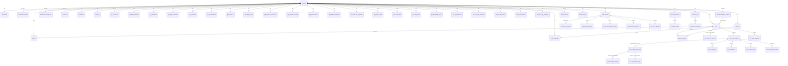

# Data Model

Source of truth: `packages/db/src/schema.ts`

## Entity Relationships

```mermaid
erDiagram
  projects ||--o{ queries : has
  projects ||--o{ competitors : has
  projects ||--o{ runs : has
  projects ||--o| measurement_plans : "activates"
  projects ||--o{ measurement_plan_versions : "publishes"
  projects ||--o{ measurement_segments : "identifies"
  measurement_plan_versions ||--o{ runs : "optionally pins"
  projects ||--o| schedules : "has (1:1)"
  projects ||--o{ notifications : has
  projects ||--o{ audit_log : has
  projects ||--o{ insights : has
  projects ||--o{ health_snapshots : has

  runs ||--o{ query_snapshots : contains
  runs ||--o{ insights : "analyzed in"
  runs ||--o{ health_snapshots : "scored in"
  queries ||--o{ query_snapshots : "tracked in"

  runs ||--o| site_crawl_run_requests : "freezes request identity"
  runs ||--o{ site_crawl_attempts : "executes"
  runs ||--o| site_crawl_snapshots : "publishes"
  site_crawl_attempts ||--o| site_crawl_graph_layouts : "publishes derived layout"
  site_crawl_attempts ||--o{ site_crawl_pages : "observes"
  site_crawl_attempts ||--o{ site_crawl_edges : "observes"
  site_crawl_graph_layouts ||--o{ site_crawl_graph_nodes : "positions sampled pages"
  site_crawl_graph_layouts ||--o{ site_crawl_graph_edges : "samples rendered edges"
  site_crawl_attempts ||--o{ site_crawl_findings : "derives"
  site_crawl_attempts ||--o{ site_crawl_event_receipts : "checkpoints"

  projects ||--o| ga_connections : "has (1:1)"
  projects ||--o{ ga_traffic_snapshots : has
  projects ||--o{ ga_daily_totals : has
  projects ||--o{ ga_traffic_summaries : has
  projects ||--o{ ga_ai_referrals : has
  projects ||--o{ ga_social_referrals : has

  projects ||--o{ gbp_locations : has
  projects ||--o{ gbp_daily_metrics : has
  projects ||--o{ gbp_keyword_impressions : has
  projects ||--o{ gbp_keyword_monthly : has
  projects ||--o{ gbp_place_actions : has
  projects ||--o{ gbp_lodging_snapshots : has
  projects ||--o{ gbp_attributes_snapshots : has
  projects ||--o{ gbp_place_details : has

  projects ||--o{ gsc_search_data : has
  projects ||--o{ gsc_daily_totals : has
  projects ||--o{ gsc_query_daily_totals : has
  projects ||--o{ gsc_url_inspections : has
  projects ||--o{ gsc_coverage_snapshots : has

  projects ||--o{ bing_url_inspections : has
  projects ||--o{ bing_keyword_stats : has
  projects ||--o{ bing_coverage_snapshots : has

  projects ||--o{ traffic_sources : has
  traffic_sources ||--o{ traffic_event_receipts : deduplicates
  traffic_sources ||--o{ crawler_events_hourly : "rolls up"
  traffic_sources ||--o{ ai_user_fetch_events_hourly : "rolls up"
  traffic_sources ||--o{ ai_referral_events_hourly : "rolls up"
  traffic_sources ||--o{ raw_event_samples : "samples"

  projects ||--o| agent_sessions : "has (1:1)"
  projects ||--o{ agent_memory : has

  projects ||--o{ discovery_sessions : has
  discovery_sessions ||--o{ discovery_probes : contains
  projects ||--o{ research_runs : has
  research_runs ||--o{ research_run_queries : contains
```

## Table Groups

### Core Domain

| Table | Purpose | Key Constraints |
|-------|---------|----------------|
| **projects** | Root entity — domain, location config, sweep provider list, per-project `provider_models` overrides, optional `research_provider` (kept separate so a text-only route cannot become a sweep engine), `measurement_config` (JSON: marketing hosts, brand terms, and GA4 lead-event names), optional `icp_description` (free-text ICP used by discovery seed phase) | Unique: `name` |
| **queries** | Tracked queries per project. `provenance` tags where the entry came from (e.g. `cli`, `discovery:<session_id>`) so adopted basket entries can be traced back to a discovery run. | Unique: `(projectId, query)` |
| **competitors** | Competitor domains per project. `provenance` tags origin (`cli`, `discovery:<session_id>`) for the same traceability reason. | Unique: `(projectId, domain)` |
| **measurement_plans** | Optional active-plan pointer for a project. | PK: `projectId`; composite FK `(projectId, activeVersionId)` → plan version |
| **measurement_plan_versions** | Immutable canonical Target-model revisions. A revision freezes project brand identity, Targets, optional reporting groups, URL matchers, query snapshots, deduplicated execution nodes with expected snapshot counts, and baseline/Target usage edges. Groups never own queries or execution edges. | Unique: `(projectId, revision)` |
| **measurement_segments** | Stable project-local identity for a Target or group, including its immutable `kind`. Only explicit retirement permanently prevents key reuse; omission from a revision does not. First publish a revision without the key, then run `canonry measurement-plan retire <project> <stable-key>` (or the matching API/MCP mutation). Retirement is idempotent and irreversible. Labels, memberships, aliases, and URL matchers remain versioned in canonical plan JSON. | Unique: `(projectId, stableKey)` |
| **runs** | Existing sweep executions. A run queued for a project freezes the requested provider/model set in `measurement_execution_identity`; v2 also pins route ID, route revision, and a non-secret policy fingerprint. A run with an active plan also pins `measurement_plan_version_id`, its execution graph, and any group/target scope in `measurement_manifest`; planless runs keep the plan fields null. | FK: projectId → projects; optional composite FK `(projectId, measurementPlanVersionId)` → plan version |
| **query_snapshots** | Per-query per-provider results. `provider` and `model` are requested identities; nullable `served_provider` and `served_model` contain only identities the upstream response disclosed. A row written by a plan-aware run also records `measurement_execution_id`, the `requested_context` it was measured under, and `supported_context` — filled only when the provider actually forwards the location, null otherwise. Historical and planless rows keep all three measurement fields null. | FK: runId → runs, queryId → queries |
| **research_runs** | Saved batch header for ad-hoc model research. Isolated from tracked monitoring. | FK: projectId → projects, unique `(projectId, idempotencyKey)` |
| **research_run_queries** | One persisted answer/evidence result per research batch query. | FK: researchRunId → research_runs, unique `(researchRunId, position)` |
| **schedules** | Cron schedules (1:1 with project) | Unique: projectId |
| **notifications** | Alert configurations per project | FK: projectId → projects |
| **audit_log** | Change tracking | FK: projectId → projects (optional) |

`research_runs` and `research_run_queries` are the durable ad-hoc research
history. They are deliberately not linked to `queries`, `runs`, or
`query_snapshots`: a research request never changes the tracked basket or any
monitoring metric. Deleting a project cascades to its research runs, and
deleting a research run cascades to its query results.

Measurement planning is additive. Existing projects and ordinary
`answer-visibility` runs do not require a plan, and publishing a plan does not
change their metrics or scheduling. The compiler freezes a deduplicated graph:
every project query gets a baseline edge, while user-selected Target assignments
add attribution edges to the same execution node when query text and context are
identical. Optional groups own membership and competitor metadata only; their
reporting edges are derived from member Target assignments and never own query
intent. A plan-aware runner can later pin the exact revision and manifest so
historical execution remains reproducible after the active plan or tracked-query
library changes.

### Technical AEO Crawl Persistence

Migration 126 adds the local full-crawl graph beside the legacy
`site_audit_snapshots` and `site_audit_pages` scorecard tables. Migration 127
adds the separately persisted Site Health visualization projection: a
publication-time Graphology ForceAtlas2 worker lays out a deterministic bounded
sample (at most 20,000 nodes and 50,000 edges). Coordinates never alter the
canonical crawl inventory or run in the browser. A new layout seeds surviving
node keys from the prior complete, compatible layout so rescans preserve the
operator's spatial frame while newly discovered pages receive deterministic
hash seeds.
Migration 128 preserves both the operator-requested crawl root and the
effective root followed after a supported host redirect. It also indexes both
graph-edge endpoints so derived-layout cleanup stays bounded.
Migration 131 separates nav, header, and footer links from content links. A
`(target page, normalized anchor)` pair carried by at least 70 percent of the
scan's fetched pages is template chrome; on real sites that distribution is
bimodal, so the threshold sits in an empty middle. A stored link row aggregates
EVERY anchor the crawl saw between the same two pages, so migration 133
corrects which anchor decides: chrome only when every anchor on the row is
ubiquitous. Migration 131 used the most ubiquitous one, which handed an
in-prose link that shared a row with a footer link to the same target the
footer's ratio and hid it. Any site with a comprehensive footer had this, so
133 re-runs the same backfill to reclassify every stored scan. Template links are excluded
from the ForceAtlas2 physics, so positions describe content structure, but they
are still published in the sample and tagged, so a viewer can draw them without
a refetch and without any page moving. Below 15 fetched pages nothing is marked
and the snapshot records `unavailable-too-few-pages`, because on a site that
small every link looks ubiquitous. The backfill classifies every stored scan
from rows the crawl already persisted; it deliberately does not rewrite
immutable layout coordinates, and those rows keep `template_links_excluded = 0`
so the map can say their positions predate the split.
Migration 138 replaces the rule for every NEW scan. The crawler (aeo-audit
4.7.0) reports where each link occurrence sat, from the page's own landmarks,
and those three counts are stored per link beside the landmark ruleset version
on the snapshot. Any content occurrence makes a link editorial, navigation with
no content occurrence makes it chrome, and `unknown` carries no evidence, so a
link the page said nothing about falls back to ubiquity where the scan is large
enough. Where it is not, the link is still a content link (`is_template` is a
strict boolean on every classified row, so the layout input, the graph sample,
both link filters, the totals, and the map all keep ONE definition of a content
link) and `templateSource` reports `unmeasured` so a consumer can subtract it. Ubiquity keys on (target URL, anchor
text), so it cannot see an editorial link whose anchor text matches the nav's,
which is the common case because good anchor text reuses the destination's name:
53 editorial links added to canonry.ai moved the measured content-link count by
zero. Migration 138 adds only columns and backfills NOTHING, because a crawl
captured before the ruleset existed never observed placement and any value
written for it would be invented; those scans keep their ubiquity
classification and a NULL ruleset version, which is what makes reads report
`applied` rather than `applied-placement`. Which rule produced a scan's numbers
is reported by `template_detection` (`applied`, `applied-placement`,
`applied-placement-with-ubiquity`, `applied-placement-partial`) and per link by
the derived `templateSource`, so no count mixes the two rules silently.
Changing which links reach the ForceAtlas2 input changes positions, so the
layout algorithm moved to `site-health-fa2-v5` and v4 coordinates are not
reused as seeds.

| Table | Purpose | Key Constraints |
|-------|---------|----------------|
| **site_crawl_run_requests** | Canonical effective options and identity for a queued crawl. Identical requests may reuse one active run; different options receive a conflict. | PK: `runId`; composite FK `(projectId, runId)` → runs |
| **site_crawl_attempts** | Mutable event-stream progress for one execution attempt. | Unique: `(runId, attemptNumber)`; composite FK to runs |
| **site_crawl_snapshots** | Immutable terminal crawl metadata, including the requested root, effective root, which rule classified the links (`template_detection`; NULL means a scan published before it existed), and the crawler landmark ruleset behind that rule (`link_placement_ruleset_version`; NULL means the scan recorded no placement and can never be reclassified). Default reads select only the latest complete snapshot; explicitly selected partial runs remain historical. | Unique: `runId`; composite FK to runs and attempt |
| **site_crawl_pages** | URL inventory with discovery provenance, fetch/indexability state, depth, internal-link counts, and link score. | Unique: `(projectId, runId, attemptId, nodeKey)` |
| **site_crawl_edges** | Bounded typed link observations with occurrence, followability, anchor summaries, the crawler placement split (`placement_navigation_occurrences` / `placement_content_occurrences` / `placement_unknown_occurrences`; all NULL means the scan recorded none, which is different from all zero), and the template-link decision (`is_template` plus the `template_ratio` that the ubiquity fallback produced). NULL `is_template` means never classified, never "not a nav link". | Unique: `(projectId, runId, attemptId, edgeKey)` |
| **site_crawl_graph_layouts** | One immutable derived-layout status per crawl attempt, with version, failure code, source totals (including the template-link share), sampled counts, and whether template links were kept out of the physics. Absent means a pre-v127 snapshot; `unavailable` means layout could not safely publish and does not invalidate the crawl. | Unique: `(projectId, runId, attemptId)` |
| **site_crawl_graph_nodes** | The bounded, ranked subset of canonical pages rendered by Site Health, carrying only persisted finite `x/y` coordinates. | Unique: `(projectId, runId, attemptId, nodeKey)` and `(projectId, runId, attemptId, sampleRank)` |
| **site_crawl_graph_edges** | Exact bounded, ranked canonical-edge subset used for both ForceAtlas2 and the WebGL renderer, each carrying its template-link flag; both endpoints reference persisted graph nodes. Template links stay in the sample so the map can draw them without a refetch. | Unique: `(projectId, runId, attemptId, edgeKey)` and `(projectId, runId, attemptId, sampleRank)` |
| **site_crawl_findings** | Deterministic crawl findings. Dead-link rows exist only when that run opted in. | Unique: `(projectId, runId, attemptId, findingKey)` |
| **site_crawl_event_receipts** | Idempotency receipts for streamed page, edge, metric, progress, and summary batches. | Unique: `(attemptId, sequence, batchId)` |

All detail rows carry the project, run, and attempt tuple. Composite foreign
keys prevent data from crossing project or attempt boundaries. The mutable
attempt is not the current graph; only a complete terminal snapshot is the
default current graph. An explicitly selected partial terminal snapshot remains
inspectable. Layout failure, timeout, empty crawl, or absence on a legacy
snapshot is exposed as a truthful unavailable graph state; it never makes a
successful crawl fail or causes the UI to recompute positions.

Agent reads use the canonical `site_crawl_pages` and `site_crawl_edges` rows,
not the sampled visualization tables. A bounded semantic subgraph exposes the
same page state, crawl depth, importance, and link evidence that the operator
can inspect. Path reads follow persisted internal links. Run-change reads
compare two immutable complete snapshots by stable page and edge identity at
query time; ForceAtlas2 coordinates are never considered a website change.

#### `projects.provider_models`

`projects.provider_models` is a JSON map of provider name to a model ID used
for future sweeps. `{}` inherits the instance-level provider settings. It is
not historical attribution — for that, see the two model columns on
`query_snapshots` below.

`projects.research_provider` is a separate nullable preference for free-form
research and other text-only work. It can name a configured engine route. It
never joins `projects.providers`, so saving a generic gateway route does not
make it eligible for citation measurement.

#### Requested vs served snapshot identity

Every snapshot preserves requested identity separately from any identity the
upstream response disclosed:

| Column | Meaning |
|--------|---------|
| `provider` | The Canonry adapter or route requested for the snapshot. |
| `model` | What we **requested** — the configured model ID resolved at sweep time. |
| `served_provider` | The upstream provider identity reported by the response. Nullable. |
| `served_model` | What the provider **reported serving**, read back off its own response. Nullable. |

`model` is **not** the source of truth for model continuity or trend
interpretation. It records our request, not the model that produced the answer,
and the two diverge routinely: every OpenAI row in production requested
`gpt-5.4` and was served the dated snapshot `gpt-5.4-2026-03-05`. Attribute a
change in answers to `served_model`; use `model` only to describe configuration.

Compare `served_model` at **top-level granularity** for attribution. A dated
snapshot is the same model for our purposes, so `gpt-5.4` → `gpt-5.4-2026-03-05`
is not a model change, while `gpt-5.6` → `gpt-5.6-sol` is (a tier suffix is a
different model at a different price). Comparing the raw strings would also
manufacture a fake model change at every provider deploy boundary.

Known gaps — `served_model` is nullable because absence is common and honest:

- **Gemini rows recorded before this column existed are NULL.** Gemini reports
  its identity as `modelVersion`, which the adapter dropped before storage, so
  no served value survives for those rows. It is captured going forward.
- **Some models disclose nothing more specific than the alias requested.**
  `chat-latest` echoes itself, so `served_model` equals `model` and reveals no
  underlying snapshot.
- **CDP snapshots have no model identity at all.** That provider scrapes the
  web UI rather than calling an API, so it never sets `served_model`.

Never fall back to `model` when `served_model` is NULL — that would launder a
configuration value into an observation. Treat NULL as unknown.

The same rule applies to provider identity: never copy `provider` into
`served_provider`. A router may not disclose which upstream provider served the
request, and unknown evidence must remain null.

### Integrations — Google

| Table | Purpose |
|-------|---------|
| **google_connections** | OAuth credentials, domain-scoped. Unique: `(domain, connectionType)` |
| **gsc_search_data** | GSC search analytics data synced per run (query × page × country × device × date) |
| **gsc_daily_totals** | GSC property-level daily totals (no query/page dimensions). Headline clicks/impressions/CTR/position + daily trend source. Unique: `(project_id, date)` |
| **gsc_query_daily_totals** | Per-QUERY daily totals fetched with `dimensions: ['date','query']` (no `page`). Summing `gsc_search_data` by query fans one SERP into one row per ranking page, inflating impressions ~0% for single-page queries but ~500% for terms where several pages rank together. Complete for queries Google NAMES; anonymized rare queries are still absent, so it does not sum to the property total. Unique: `(project_id, date, query)` |
| **gsc_url_inspections** | URL inspection results from GSC |
| **gsc_coverage_snapshots** | Index coverage snapshots from GSC. `indexed` / `not_indexed` / `unknown_pages` are three distinct states — a page with no impressions and no inspection is UNKNOWN, never not-indexed. `verified_by_inspection` / `derived_from_impressions` record how much of the number is a real Google verdict versus derived free from search analytics. |

### Integrations — Bing

| Table | Purpose |
|-------|---------|
| **bing_connections** | API credentials, domain-scoped. Unique: `domain` |
| **bing_url_inspections** | URL inspection results from Bing |
| **bing_keyword_stats** | Keyword performance data from Bing |
| **bing_coverage_snapshots** | Bing index coverage snapshots |

### Integrations — Google Analytics

| Table | Purpose |
|-------|---------|
| **ga_connections** | GA4 property connection (1:1 with project) |
| **ga_traffic_snapshots** | Per-page daily traffic snapshots. Includes `sessions`, `organic_sessions`, and `direct_sessions` (nullable; populated by GA4 sync) — supports per-channel landing-page breakdowns. |
| **ga_daily_totals** | GA4 property-level daily totals (no landing-page dimension), so `users` is deduplicated by GA and matches the GA UI. `SUM(users)` over `ga_traffic_snapshots` overcounts multi-page visitors and must not be used for a daily user count. Also holds `engagement_rate` (a real GA4 metric, requested directly) and `new_users`; returning users are DERIVED as `users - new_users` because GA4 exposes no `returningUsers` metric, and the subtraction is exact here since the date-only grain has GA deduplicate both counts inside the day. Both columns are nullable with no default — rows written before v116 have no reading, and a 0 would read as a real "nobody engaged, nobody returned" day. Unique: `(project_id, date)` |
| **ga_traffic_summaries** | Aggregated traffic summaries |
| **ga_ai_referrals** | AI engine referral tracking. `traffic_class` splits `paid` AI traffic (paid/cpc/sponsored UTM values or GA4 paid channel groups, including tagged ChatGPT ads) from `organic`/non-paid AI referrals. Unique: `(projectId, date, source, medium, sourceDimension, channelGroup, landingPage)` |
| **ga_social_referrals** | Social media referral tracking. Unique: `(projectId, date, source, medium, channelGroup)` |
| **ga_acquisition_daily** | GA4 session acquisition rows at `(project, date, channel group, source, medium, host, landing page)` grain. `landing_page_normalized` supports page rollups; sessions are non-negative. |
| **ga_lead_events_daily** | GA4 configured lead-event counts at acquisition dimensions plus `event_name` and `attribution_scope`. Scope is `landing-page` or `channel`; counts are non-negative, and the full grain is unique. |
| **ga_measurement_sync_state** | One per-project status row for acquisition and lead components. Each component is `never-synced`, `ready`, or `error`, with its error/timestamp; lead scope is nullable until a lead sync establishes `landing-page` or `channel`. |

### Integrations — Google Business Profile

Local-AEO signals. The OAuth connection reuses `google_connections` with `connectionType = 'gbp'`. All surface tables are scoped to the project's selected locations.

| Table | Purpose |
|-------|---------|
| **gbp_locations** | Discovered locations per project; `selected` flags which feed sync + analytics. `place_id` / `maps_uri` (from location metadata) link a location to the Places API. FK: projectId → projects |
| **gbp_daily_metrics** | Daily performance metrics per (location, date, metric). Range-replaced each sync. |
| **gbp_keyword_impressions** | Search-keyword impressions over the trailing synced window (one aggregate per keyword; `period_start`/`period_end` are YYYY-MM). Range-replaced each sync. Unique: `(projectId, locationName, periodEnd, keyword)` |
| **gbp_keyword_monthly** | Per-month keyword impressions series — **accumulates** across syncs (recent complete months upserted, older in-retention months preserved) so intelligence can detect month-over-month keyword drops. Unique: `(projectId, locationName, month, keyword)` |
| **gbp_place_actions** | Booking / reservation / order CTAs per location (`provider_type` MERCHANT = direct, AGGREGATOR = OTA). Range-replaced each sync. |
| **gbp_lodging_snapshots** | Hotel Lodging API resource, snapshot-on-change. `populated_group_count = 0` means the Lodging API returned no readable structured groups; live testing found this can happen even when the owner-facing "Hotel details" panel has amenities set, so it is a verify signal, not a confirmed gap. |
| **gbp_attributes_snapshots** | Owner-set Business Profile attributes (Business Information API `getAttributes`), snapshot-on-change. The generic, any-category amenity / service / accessibility / identity / social-URL tags the owner has set (e.g. `has_onsite_services`, `offers_online_estimates`, `is_owned_by_women`, `url_instagram`). `attribute_count` is the count of set attributes (the API returns only set ones), so unlike lodging this is a reliable owner-readable completeness signal. Works for every business type, not just hotels. |
| **gbp_place_details** | Places (New) rendered-listing snapshots (amenities, accessibility, editorial summary) for lodging locations, fetched via the Places API key and snapshot-on-changed. `tier` records the field-mask SKU. Cross-referenced against the lodging profile for the `gbp-listing-discrepancy` insight (#648). |

### Integrations — OpenAI Ads (ChatGPT ads)

| Table | Purpose |
|-------|---------|
| **ads_connections** | One OpenAI ad-account connection per project (ad accounts are not domain-bound, so this keys on project like `ga_connections`). Metadata + sync state only — the Ads Manager "SDK key" lives in `~/.canonry/config.yaml`. Each sync records the account's brand-review status plus integrity-review status and decision. `conversion_tracking_configured` is derived from whether any synced campaign carries a conversion-event setting. |
| **ads_operations** | Durable receipts for upstream mutations. Unique `(project_id, operation_key)` plus a canonical request hash prevents duplicate sends and detects key reuse with a different request. Each new receipt is bound to the live-verified `ad_account_id`; legacy unbound receipts and receipts presented under another account remain unresolved. State is `pending`, `reconciling`, `succeeded`, `failed`, or `unknown`; ambiguous outcomes are reconciled by reading a checkpointed provider ID and are never resolved by retrying the original mutation. `reconcile_strategy` is the closed `known_entity`, `create_fingerprint`, or `manual_only` policy; an uncheckpointed create stays unknown because mutable-field equality cannot prove provenance. `reconcile_parent_id` independently binds a parented create and `reconcile_fingerprint` hashes the provider-visible safe-field projection actually compared during recovery. Attempt timestamps and an expiring worker lease support a five-attempt exponential-backoff policy; exhausted receipts remain visible as `unknown` with `ADS_RECONCILIATION_QUARANTINED` but are never reclaimed again. Stores sanitized error metadata and verification inputs, never the SDK key, URLs, or raw request payload. |
| **ads_activation_grants** | Short-lived human approvals for one exact campaign tree. The row binds the canonical manifest hash and JSON, project, advertiser account, approver key, distinct executor key, expiry, lifecycle state, and the single activation operation that consumed it. Revocation is allowed only before execution. No provider credential or creative payload is stored. |
| **ads_operation_steps** | Durable child checkpoints for a grant-bound campaign-tree activation. Each ordered campaign, ad-group, or ad step records the approved upstream timestamp, execution/rollback state, verified provider timestamp, and sanitized remediation text. These checkpoints let a replay inspect an ambiguous step without blindly resending activation and preserve the ads-first / groups-second / campaign-last execution order. |
| **ads_campaigns** | Campaign snapshots, range-replaced per project on every `ads-sync`. Includes description, flight dates, upstream lifecycle timestamps, budgets in integer micros, the closed `bidding_type` vocabulary (`impressions` or `clicks`), attached `conversion_event_setting_ids`, and raw upstream targeting (the API projects location IDs). Ids are upstream ids (`cmpn_…`). |
| **ads_ad_groups** | Ad-group snapshots incl. description, upstream lifecycle timestamps, and the closed `billing_event_type` vocabulary (`impression` or `click`). `context_hints` (JSON `string[]`) is the targeting primitive — entries are multi-line strings of newline-separated example queries; the paid/organic overlap matcher joins these against tracked queries. Cascades off `ads_campaigns`. |
| **ads_ads** | Ad snapshots with the `chat_card` creative JSON and review status. Cascades off `ads_ad_groups`. |
| **ads_insights_daily** | Daily paid-performance rollups, one row per `(level, entity, date)`. `spend_micros` is integer micros — the upstream insights API returns decimal dollars, normalized at ingest. `conversions` is the integer conversion count (0 when the account has no conversion tracking). Derived ratios (ctr/cpc) computed at read time. Upserts on conflict so re-syncing an in-progress day replaces. |

### Server-Side Traffic Ingestion

| Table | Purpose |
|-------|---------|
| **traffic_sources** | Per-connection metadata for Cloud Run, WordPress, Vercel, and Cloudflare. Status `connected` / `paused` / `error` / `archived`. Pull credentials, Cloudflare direct-push secrets, and Queue API tokens live in `~/.canonry/config.yaml`, never here; push sources store only a bearer digest. Queue pull adds nullable owner/expiry fields for one durable source-scoped sync lease, including stale-owner recovery, plus the last observed residual Queue depth and observation time so a bounded drain cannot hide remaining work. FK: projectId → projects. |
| **traffic_event_receipts** | Durable transport-neutral idempotency claims keyed by `(source_id, event_id)`. A push receiver or buffered pull consumer claims the event in the same transaction as its rollup writes, then acknowledges upstream only after commit. `expires_at` lets each delivery mode retain claims for its full replay/redelivery horizon. FK: sourceId → traffic_sources (cascade). |
| **crawler_events_hourly** | Hourly rollup of server-observed bulk crawler hits (GPTBot, OAI-SearchBot, PerplexityBot, Googlebot, etc.). Composite PK `(projectId, sourceId, tsHour, botId, verificationStatus, pathNormalized, status)` so repeat syncs upsert via `hits + ?`. Excludes the per-user-fetch UAs — those land in `ai_user_fetch_events_hourly`. |
| **ai_user_fetch_events_hourly** | Hourly rollup of on-demand per-user fetches from AI surfaces (ChatGPT-User, Perplexity-User, MistralAI-User). UA-evidenced like a crawler, but each hit was initiated by a real user inside an AI surface — kept disjoint from `crawler_events_hourly` so dashboard / API totals don't conflate machine crawl with human-in-the-loop fetch. Composite PK matches `crawler_events_hourly`. |
| **ai_referral_events_hourly** | Hourly rollup of server-observed human AI-referral clicks (UTM or referer evidence). Composite PK matches the crawler bucket pattern. `paid_sessions_or_hits` / `organic_sessions_or_hits` split `sessions_or_hits` by traffic class; unclassified is the residual `sessions_or_hits - paid - organic`. The split rides the measure (not the PK) because the paid marker lives in the query string that `landing_path_normalized` strips, so one bucket can hold both classes. Rows written before the ingest classifier (both counters 0) surface as unclassified rather than organic. |
| **raw_event_samples** | Bounded sample tail for classifier debugging. Source writes reject already-expired samples and prune source-local rows; a startup and daily global sweep removes expired rows from dormant sources. Timestamps are canonical UTC, and the 30-day boundary is inclusive. FK: sourceId → traffic_sources. |

### Intelligence

| Table | Purpose |
|-------|---------|
| **insights** | Per-run analysis insights (regressions, gains). FK: projectId → projects, runId → runs |
| **health_snapshots** | Citation health snapshots per run. FK: projectId → projects, runId → runs |

### System

| Table | Purpose |
|-------|---------|
| **api_keys** | API authentication. Unique: `keyHash` |
| **usage_counters** | Rate limiting and usage tracking. Unique: `(scope, period, metric)` |
| **oauth_clients** | OAuth 2.1 clients for the remote MCP surface. `registration` records how one came to exist: `operator` (created deliberately) or `dynamic` (registered itself over the open RFC 7591 endpoint and chose its own display name, so the consent screen marks that name unverified). `secretHash` is NULL for a public client authenticating by PKCE alone. `redirectUris` is an exact-match allowlist, except that RFC 8252 s7.3 lets the PORT float for loopback redirects so a native app can bind an ephemeral one. Revoking a client also revokes its outstanding tokens |
| **oauth_authorization_codes** | Single-use authorization codes, 60s TTL, bound to their PKCE challenge and RFC 8707 resource. Key is the SHA-256 of the code. Burned on first redemption even when that attempt fails, so a wrong verifier cannot be retried. FK: clientId → oauth_clients, userId → users |
| **oauth_tokens** | Issued access and refresh tokens, stored as SHA-256 digests for the same reason `user_sessions` stores one: the row records that a token exists, it is not a way to become it. `resource` is the audience and is enforced on every resource request. Refresh tokens rotate, so a stolen one is usable at most once. FK: clientId → oauth_clients, userId → users |

### Agent

| Table | Purpose |
|-------|---------|
| **agent_sessions** | One rolling Aero session per project. Durable half of the hybrid session registry — stores transcript, queued follow-ups, and chosen provider/model so a live pi-agent-core Agent can be rehydrated after a restart. Unique: `projectId`. FK: projectId → projects |
| **agent_memory** | Project-scoped durable notes written by Aero (`remember`), the operator (CLI / API), or the compaction summarizer. Hydrated into every new session's system prompt under `<memory>`. Keys starting with `compaction:` are reserved for summarized transcript slices. Unique: `(projectId, key)`. FK: projectId → projects |

### Discovery (three-ring model)

| Table | Purpose |
|-------|---------|
| **discovery_sessions** | One row per `canonry discover run` invocation. Captures the research artifact for a session: ICP snapshot, seed/dedup/probe phase counts, bucket counts (cited / aspirational / wasted-surface), `competitor_map` as a JSON array of `{domain, hits}` entries (default `'[]'`), a nullable `warning` (non-fatal operator flag, e.g. the seed-dedup degenerate-collapse guard), and the nullable seed-source diagnostics `seed_from_answer_count` / `seed_from_grounding_count, seed_brand_filtered_count` (split of raw seed candidates by origin — answer text vs. grounding fan-out — recorded at seed time; null on legacy sessions, consumed by no gate). Status flows `queued → seeding → probing → completed` (or `failed`). FK: projectId → projects |
| **discovery_probes** | One row per (session × candidate query) probe. Stores the query text (free-form — not promoted to `queries` until the operator adopts it), citation_state, cited_domains, `answer_mentioned` (the answer-text mention signal, independent of citation; nullable for legacy rows), bucket classification, and raw provider response. **No `UNIQUE(session_id, query)`** so v2 multi-provider amplification can probe the same query across Gemini + ChatGPT + Claude in one session without a migration. FK: sessionId → discovery_sessions, projectId → projects |
| **research_runs / research_run_queries** | Saved, isolated free-form research batches. Each result stores the answer, source links, cited domains, answer-text named competitors, and cited competitor domains as separate signals. They never create tracked `queries`, shared `runs`, snapshots, insights, notifications, or schedules. |

### Content

| Table | Purpose |
|-------|---------|
| **content_target_dismissals** | Per-recommendation "mark addressed" records. The report/targets surfaces filter out any `target_ref` present here. Unique: `(projectId, targetRef)`. FK: projectId → projects |
| **recommendation_explanations** | Cached LLM prose rationale ("Why this?") for a content recommendation. Keyed by prompt version so a template bump invalidates forward. Unique: `(projectId, targetRef, promptVersion)`. FK: projectId → projects |
| **recommendation_briefs** | Cached LLM **structured** content brief (`brief` JSON column: `{targetQuery, winnabilityClass, angle, whyWinnable, schemaHookup, controllableSurfaceRationale}`). Separate table from `recommendation_explanations` so the structured payload and its version-keyed cache never collide with the prompt-version-blind explanation lookup. Gated to `ownable` targets. Unique: `(projectId, targetRef, promptVersion)`. FK: projectId → projects |
| **domain_classifications** | Durable per-domain cited-surface classification (`competitorType`) accumulated from discovery completions, upserted last-write-wins. Powers the deterministic `winnabilityClass` gate on content targets without re-running discovery. Unique: `(projectId, domain)`. FK: projectId → projects |

## JSON Columns

Several text columns store serialized JSON. Always use `parseJsonColumn()` from `@ainyc/canonry-db`:

| Table.Column | Expected Shape |
|-------------|---------------|
| `projects.locations` | `LocationContext[]` |
| `projects.providers` | `string[]` |
| `projects.tags` | `string[]` |
| `projects.labels` | `Record<string, string>` |
| `projects.ownedDomains` | `string[]` |
| `measurement_plan_versions.canonicalJson` | `MeasurementPlan` (native `mode: 'json'`) |
| `runs.measurementManifest` | `MeasurementRunManifest` (native `mode: 'json'`) |
| `query_snapshots.citedDomains` | `string[]` |
| `query_snapshots.groundingSources` | `GroundingSource[]` |
| `query_snapshots.competitorOverlap` | `string[]` (legacy mixed mention/citation evidence; never a metric source by itself) |
| `insights.recommendation` | `{ action: string; detail?: string }` |
| `insights.cause` | `{ category: string; detail?: string }` |
| `health_snapshots.providerBreakdown` | `Record<string, { total: number; cited: number; rate: number }>` |
| `discovery_sessions.competitorMap` | `Array<{ domain: string; hits: number; competitorType: DiscoveryCompetitorType }>` |
| `discovery_probes.citedDomains` | `string[]` |
| `research_run_queries.namedCompetitors` | `string[]` |
| `research_run_queries.citedCompetitorDomains` | `string[]` |
| `recommendation_briefs.brief` | `ContentBriefDto` (native `mode: 'json'`, not via `parseJsonColumn`) |

## Conventions

- All IDs are text (UUIDs generated with `crypto.randomUUID()`).
- All timestamps are ISO 8601 text strings.
- All project-owned tables cascade delete when the project is deleted.
- Google/Bing connections are domain-scoped (not project-scoped) to support multiple projects per domain.
- GA4 connections are project-scoped (1:1).
